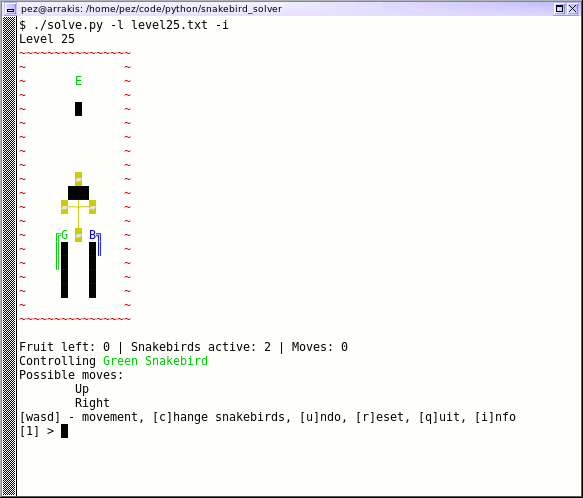
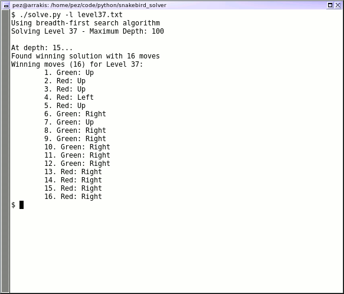

Snakebird Bruteforce Solver
===========================

This is a bruteforce solver for the excellent puzzle game Snakebird
(and its cousin Snakebird Primer), by Noumenon Games, and can be
used as a console version of those games.

- http://snakebird.noumenongames.com/
- https://store.steampowered.com/app/357300/Snakebird/
- https://store.steampowered.com/app/1014140/Snakebird_Primer/

 

Puzzles with more than one snakebird, long snakebirds, or multiple
pushable objects can easily exhaust system memory - it seems to be
roughly 1GB/minute consumption, on my CPU.  Several of the more
complex puzzles are effectively unsolveable on my own system.

The game uses one of two algorithms to find solutions:
breadth-first (the default) or depth-first.  Puzzles which are known
to work better with Depth-First are configured to default to that
one instead, though currently that's only Level 11.  The
Breadth-First attempt was inspired by another Snakebird solver on
Github: https://github.com/david-westreicher/snakebird

Note that Breadth-First Searching can get pretty memory intensive if
the tree is wide and deep enough, since we've got to keep track of
game state along each path.  The solve process for Level 16 gets to
about 6GB resident memory before it finds the solution.  Level 19 gets
to 14GB before it's even gotten to depth/step number 20.  Depth-First
should be a bit kinder to system memory, though it'll still chew up
quite a bit remembering which game states we've seen before.

There are some tests in `tests.py` which just check the solver against
known-good solutions for some of the more-quickly-solved puzzles.  Not
actual unit tests, alas, but slightly better than nothing.

Installation
============

There is no `setup.py` for this project, alas.  The base solver itself
should be runnable on any Python 3 installation.  To run in interactive
mode, the following extra modules are required (both installable with
`pip`):

- [readchar](https://pypi.org/project/readchar/)
- [colorama](https://pypi.org/project/colorama/)

The solver benefits greatly from being run with PyPy3.  Processing times
will be at least halved when running with PyPy3 versus vanilla Python.
Assuming PyPy3 is installed, the following will set up a PyPy3 venv
with the necessary modules for interactive mode:

    $ pypy3 -m venv solver_venv
    $ . solver_venv/bin/activate
    (solver_venv) $ pip install -r requirements.txt

Usage
=====

To solve a level:

    ./solve.py -l levels/level01.txt

To solve a level with either DFS or BFS:

    ./solve.py -l levels/level01.txt -a DFS
    ./solve.py -l levels/level01.txt -a BFS

To run interactively:

    ./solve.py -l levels/level01.txt -i

To get help on the commandline args (though there's really only
what I just mentioned):

    ./solve.py -h

Interactive mode uses `wasd`/arrows for navigation, `tab`/`c` to
change between Snakebirds, `u` to undo, `r` to reset, and `q` to
quit.  Not the best way to play the game, really - I mostly use
it just to test out the app.

Level Definition
================

All Snakebird levels are included in the `levels` directory.  For
reference, here's what the level definition files look like.

The level definition files are just plaintext, and start off with a few
directives at the top.  The directives are case-insensitive.

    Alg: DFS
    Alg: BFS

Set Depth-First Search as the default algorithm for this level, or
Breadth-First Search (though BFS is the default, so there's not really
much point in specifying it).

    ExitOnFirst

This one only has an effect while using Depth-First Search, and will
cause the algorithm to exit when the first solution is found, rather
than trying to refine and find a shorter solution.

    AllowPushableLoss

By default, if a pushable object is knocked off the edge (to fall into
the water or whatever), the solver will consider that a losing
condition, to improve solve times.  This directive overrides that
default behavior.  We have one level which does require sacrificing
an object (level 43).

    Max: <number>

Specifies the maximum number of steps to compute.  This is most useful
for Depth-First Search, to limit the tree size, though technically it
also applies to Breadth-First as well.

    Decoration <num>: <number of lines>

Pushable objects in Snakebird often look like crosses or dumbbells,
and the only parts which actually interact with the map are the ends.
You can use this `Decoration` directive to add in "connective tissue"
as Snakebird does.  The `<num>` corresponds to the number used later
in the level definition section, and `<number of lines>` is how many
lines immediately follow this directive.  Use the capital letter `O`
to specify the "real" interactive parts of the pushable object, and
a combination of pipes, dashes, and plus signs (`|`, `-`, `+`) for
the connective tissue.  Only the very first `O` anchor point is
required, actually -- the solver will ignore any other.  An example
directive from Level 25 is:

	Decoration 0: 5
	  O
	  |
	O-+-O
	  |
	  O

Later in the `Level` section, the map uses the number `0` to place
the object into the map, which is what matches the "Decoration 0"
part of the definition.

	Level: <identifier>

This indicates that the remainder of the file contains level data.
Some empty-space padding will automatically be added along the edges,
along with a border composed of "void" cells.  The level definition
need not have a fixed width or anything; it'll be sized appropriately
as the level is read.

The following characters are used:

* `~` - "Void", generally water at the bottom.  The solver will
  automatically add a border of Void around the level.
* `w` - Walls
* `%` - Spikes
* `F` - Fruit
* `E` - Exit
* `T` - Teleporter *(exactly two are required, if using teleporters)*
* `R`/`G`/`B`/`Y` - Snakebird Heads
* `<`/`^`/`>`/`V` - Snakebird Bodies - should point towards the head.
  For instance, `G<<<` would indicate a green snakebird of length
  four, all pointing towards the left.
* `0`-`9` - Pushable objects.  These can be geographically diverse,
  and will all move as one in terms of pushing and falling, etc.  If
  you want connective decorations to be drawn between the cells of an
  object, see the `Decoration` tag at the start of the file.  You
  don't have to specify these in numerical order; mix and match if you
  like.

Performance
===========

There are a few levels whose possible trees are deep and wide enough
that I haven't let the solver run to completion.  What will kill you
is likely to be memory usage.  On my system it looks like it grows
by roughly 1GB for every minute of processing.  Solve times for *most*
levels will end up being under a minute, though, so in general it's
not too bad.  Multi-snakebird levels, or levels with multiple pushable
objects, tend to be the worst.  To date I've only solved one of the
three-snakebird levels on my system.

A few levels benefit from specifying a maximum move count when using
the depth-first search algorithm, even though Snakebird itself doesn't
have such a concept.  It helps keep the tree down to a
computationally-feasible size.  So, for some of these I've set a max
move count, knowing what the solutions already are, just to save on
processing time.  There's a default max move limit of 100, if one
isn't specified in the level file - a few levels come close to that
limit (and the solution to Star 4 is something like 140 steps long),
though in general those levels are a bit too slow to solve with this
anyway.

By default, the game will consider the loss of any pushable object to
be a game loss, even though the real game allows it.  This is done to
help trim the solving tree down a bit, since in general solutions
require all the objects to be in place.  This can be overridden on a
per-level basis with the `AllowPushableLoss` directive.

Current Solve Times
===================

Obviously this depends greatly on CPU, though the comparative times
should still apply regardless.  I'm using a pretty ancient AMD
A8-6500.  These are all just single data points - it's possible that
other CPU load could've affected my numbers here.  Note that the app
is single-threaded and will only operate on a single core.

Times are in *M:SS*.  An "(L)" in the DFS column indicates that we're
limiting the step count to improve time - without specifying that in
the file, the DFS time will be longer, sometimes very significantly
so.  An "(L+)" means that the step count we're specifying in the level
is actually set to the optimal solution length itself, so that's about
as quick as DFS will get.  The better time of the two is noted with
**bold text**.

I haven't tried many of the levels on DFS after implementing BFS, since
it turned out BFS was in general so much more effective.  If an entry
here is blank, it means that I've not even attempted solving the level
with the given algorithm.  If I've tried but cancelled after it was
clear it was going to take way too long, I've noted some relevant
information about the system state at the cancellation time.  In general
I've stopped them once they get to 9GB resident memory, since with
the other stuff generally running on my system, that's about when I'd
start swapping.

All times were collected while running PyPy3, instead of CPython.

Single Snakebird Levels
-----------------------

| Level         | Moves | BFS      | DFS           | Extras |
| ------------- | ----- | -------- | ------------- | ------ |
| **Level 0**   | 29    | **0:01** | 0:02 (L)      |        |
| **Level 1**   | 16    | **0:01** | 0:01          |        |
| **Level 2**   | 25    | **0:01** | 0:02          |        |
| **Level 3**   | 27    | **0:01** | 0:02          |        |
| **Level 4**   | 30    | **0:01** | 0:01          |        |
| **Level 5**   | 24    | **0:01** | 0:01          |        |
| **Level 6**   | 36    | **0:01** | 0:01          |        |
| **Level 10**  | 33    | **0:01** | 0:04          |        |
| **Level 11**  | 35    | 0:23     | **0:01** (L+) |        |
| **Level 12**  | 52    | **0:02** | 0:05 (L)      |        |
| **Level 21**  | 39    | **0:02** | 0:04 (L+)     |        |
| **Level 22**  | 45    | **0:01** | 0:02 (L)      | One Pushable  |
| **Level 23**  | 53    | 3:04     |               | Two Pushables |
| **Level 24**  | 26    | 0:11     |               | One Pushable  |
| **Level 30**  | 15    | 0:01     |               | Teleporter    |
| **Level 31**  | 8     | 0:01     |               | Teleporter    |
| **Level 33**  | 42    | 0:01     |               | Teleporter    |
| **Level 35**  | 29    | 0:01     |               | Teleporter    |
| **Level 39**  | 53    | 0:07     |               | Two Pushables |
| **Star 2**    | 60    | 0:03     |               |        |

Two-Snakebird Levels
--------------------

| Level         | Moves | BFS      | DFS       | Extras | Limits |
| ------------- | ----- | -------- | --------- | ------ | ------ |
| **Level 7**   | 43    | 0:07     |           |        |        |
| **Level 8**   | 29    | 0:14     |           |        |        |
| **Level 9**   | 37    | 1:12     |           |        |        |
| **Level 13**  | 44    | 0:13     |           |        |        |
| **Level 14**  | 24    | **0:01** | 0:03      |        |        |
| **Level 15**  | 34    | 0:15     |           |        |        |
| **Level 17**  | 68    | 0:04     |           |        |        |
| **Level 18**  | 35    | 0:04     |           |        |        |
| **Level 20**  | 50    | **0:04** | 0:11 (L+) |        |        |
| **Level 25**  | 35    | 2:18     |           | One Pushable   |
| **Level 26**  | 35    | 0:05     |           | One Pushable   |
| **Level 27**  | 49    | 0:12     |           | One Pushable   |
| **Level 28**  | 49    | 0:32     |           | Two Pushables  |
| **Level 29**  |       | *n/a*    |           | Four Pushables | *9G res. mem @ depth 29, 8min* |
| **Level 32**  | 21    | 0:02     |           | One Pushable, Teleporter |
| **Level 34**  | 17    | 0:03     |           | One Pushable, Teleporter |
| **Level 36**  | 29    | 0:12     |           | Teleporter |        |
| **Level 37**  | 16    | 0:02     |           | Teleporter |        |
| **Level 38**  | 28    | 0:18     |           | Teleporter |        |
| **Level 40**  |       | *n/a*    |           | Two Pushables | *9G res. mem @ depth 39, 10min* |
| **Level 41**  | 34    | **0:06** | 0:43 (L+) |        |        |
| **Level 42**  | 42    | **0:03** | 0:11 (L+) |        |        |
| **Level 43**  | 36    | 0:05     |           | One Pushable | Requires `AllowPushableLoss` |
| **Level 44**  | 36    | 0:04     |           | Teleporter |    |
| **Level 45**  |       | *n/a*    |           | Two Pushables | *9G res. mem @ depth 44, 7min* |
| **Star 4**    |       | *n/a*    |           | Three Pushables | *9G res. mem @ depth 21, 6.5min* |
| **Star 5**    | 69    | 0:29     |           | One Pushable, Teleporter |    |

Three-Snakebird Levels
----------------------

| Level           | Moves | BFS   | Extras | Limits |
| --------------- | ----- | ----- | ------ | ------ |
| **Level 16**    | 65    | 5:22  |        |        |
| **Level 19**    |       | *n/a* |        | *9G res. mem @ depth 18, 12min* |
| **Star 1**      |       | *n/a* | One Pushable | *9G res. mem @ depth 13, 8min* |
| **Star 3**      |       | *n/a* | One Pushable | *9G res. mem @ depth 28, 10min* |
| **Star 6**      |       | *n/a* | Three Pushables | *Exception at depth 27 after 4m!* |
| **??? (Space)** |       | *n/a* | One Pushable | *9G res. mem @ depth 63, 10.5min* |

*Recent (as of March 2019) updates to level state remembering and
multi-snakebird efficiency allowed our solving of Star 6 to go past
depth 25, and it turns out that there's a bug in the app somewhere
which gets triggered on the 27th move of that level.  Will have to
look into that!*

Snakebird Primer Solve Times
============================

There's not much reason to include Snakebird Primer on here, since it's
by design *much* easier than the original Snakebird, but I like being
thorough, and it was nice to take a quick trip back to the game.  There's
a few levels in here which the solver can't quite get to on my system,
as with the original Snakebird.  All of these are just breadth-first; I
didn't try out DFS for any of them.

Single Snakebird Levels
-----------------------

| Level             | Moves | BFS  | Extras |
| ----------------- | ----- | ---- | ------ |
| **Primer 1**      | 12    | 0:01 |        |
| **Primer 2**      | 27    | 0:02 |        |
| **Primer 3**      | 25    | 0:01 |        |
| **Primer 4**      | 17    | 0:01 |        |
| **Primer 5**      | 10    | 0:01 |        |
| **Primer 6**      | 35    | 0:57 |        |
| **Primer 7**      | 43    | 0:01 |        |
| **Primer 8**      | 54    | 0:01 |        |
| **Primer 9**      | 31    | 0:01 |        |
| **Primer 10**     | 22    | 0:01 |        |
| **Primer 17**     | 36    | 0:01 |        |
| **Primer 18**     | 40    | 0:09 |        |
| **Primer 19**     | 25    | 0:01 |        |
| **Primer 20**     | 31    | 0:01 |        |
| **Primer 21**     | 12    | 0:01 |        |
| **Primer 22**     | 8     | 0:01 |        |
| **Primer 23**     | 15    | 0:01 |        |
| **Primer 24**     | 24    | 0:01 |        |
| **Primer 25**     | 17    | 0:01 |        |
| **Primer 26**     | 24    | 0:01 |        |
| **Primer 27**     | 34    | 0:01 |        |
| **Primer 28**     | 21    | 0:03 |        |
| **Primer 29**     | 29    | 0:01 |        |
| **Primer 30**     | 37    | 0:01 |        |
| **Primer 31**     | 24    | 0:01 | Teleporter |
| **Primer 32**     | 8     | 0:01 | Teleporter |
| **Primer 33**     | 7     | 0:01 | Teleporter |
| **Primer 34**     | 20    | 0:01 | Teleporter |
| **Primer 35**     | 6     | 0:01 | Teleporter |
| **Primer 36**     | 19    | 0:01 | One Pushable |
| **Primer 37**     | 20    | 0:01 | One Pushable |
| **Primer 38**     | 46    | 0:02 | One Pushable |
| **Primer 39**     | 22    | 0:01 | One Pushable |
| **Primer 40**     | 31    | 0:01 | Two Pushables |
| **Primer 41**     | 21    | 0:03 | Seven Pushables |
| **Primer 42**     | 21    | 0:05 | Nine Pushables |
| **Primer 47**     | 19    | 0:01 |        |
| **Primer 48**     | 32    | 0:01 |        |
| **Primer 49**     | 18    | 0:02 |        |
| **Primer 55**     | 22    | 0:01 | One Pushable |
| **Primer 57**     | 36    | 0:01 |        |
| **Primer 58**     | 41    | 0:01 |        |
| **Primer 60**     | 8     | 0:01 | Teleporter |
| **Primer 61**     | 9     | 0:01 | Teleporter |
| **Primer 62**     | 9     | 0:01 | Teleporter |
| **Primer 63**     | 19    | 0:01 | One Pushable, Teleporter |
| **Primer 64**     | 50    | 0:02 | One Pushable |
| **Primer Star 1** | 34    | 0:08 |        |
| **Primer Star 3** | 64    | 0:01 |        |
| **Primer Star 6** | 42    | 0:04 | One Pushable |

Two-Snakebird Levels
--------------------

| Level             | Moves | BFS  | Extras |
| ----------------- | ----- | ---- | ------ |
| **Primer 11**     | 14    | 0:02 |        |
| **Primer 12**     | 9     | 0:01 |        |
| **Primer 13**     | 18    | 0:01 |        |
| **Primer 14**     | 12    | 0:01 |        |
| **Primer 15**     | 15    | 0:02 |        |
| **Primer 16**     | 28    | 1:36 |        |
| **Primer 43**     | 18    | 0:02 | One Pushable |
| **Primer 44**     | 22    | 0:02 | One Pushable |
| **Primer 45**     | 22    | 0:02 | One Pushable |
| **Primer 46**     | 40    | 0:05 | Two Pushables |
| **Primer 50**     | 16    | 0:03 |        |
| **Primer 51**     | 16    | 0:02 |        |
| **Primer 52**     | 25    | 0:02 |        |
| **Primer 53**     | 22    | 0:05 |        |
| **Primer 54**     | 22    | 0:04 |        |
| **Primer 56**     | 23    | 0:04 |        |
| **Primer 59**     | 25    | 0:03 | Two Pushables |
| **Primer 65**     | 28    | 0:02 |        |
| **Primer 66**     | 27    | 0:04 |        |
| **Primer 68**     | 21    | 0:01 |        |
| **Primer Star 5** | 22    | 0:04 | Teleporter |

Three-Snakebird Levels
----------------------

| Level         | Moves | BFS  | Extras |
| ------------- | ----- | ---- | ------ |
| **Primer 67** | 21    | 2:59 | One Pushable |

Four-Snakebird Levels
---------------------

| Level                    | Moves | BFS   | Extras | Limits |
| ------------------------ | ----- | ----- | ------ | ------ |
| **Primer 69**            |       | *n/a* |        | *(9G res. mem @ depth 11, 8.5min)* |
| **Primer Star 2**        | 25    | 2:00  |        |        |
| **Primer Star 4**        |       | *n/a* |        | *(9G res. mem @ depth 12, 9.5min)* |
| **Primer Final (Space)** |       | *n/a* | Two Pushables  | *(9G res. mem @ depth 77, 12min)* |

